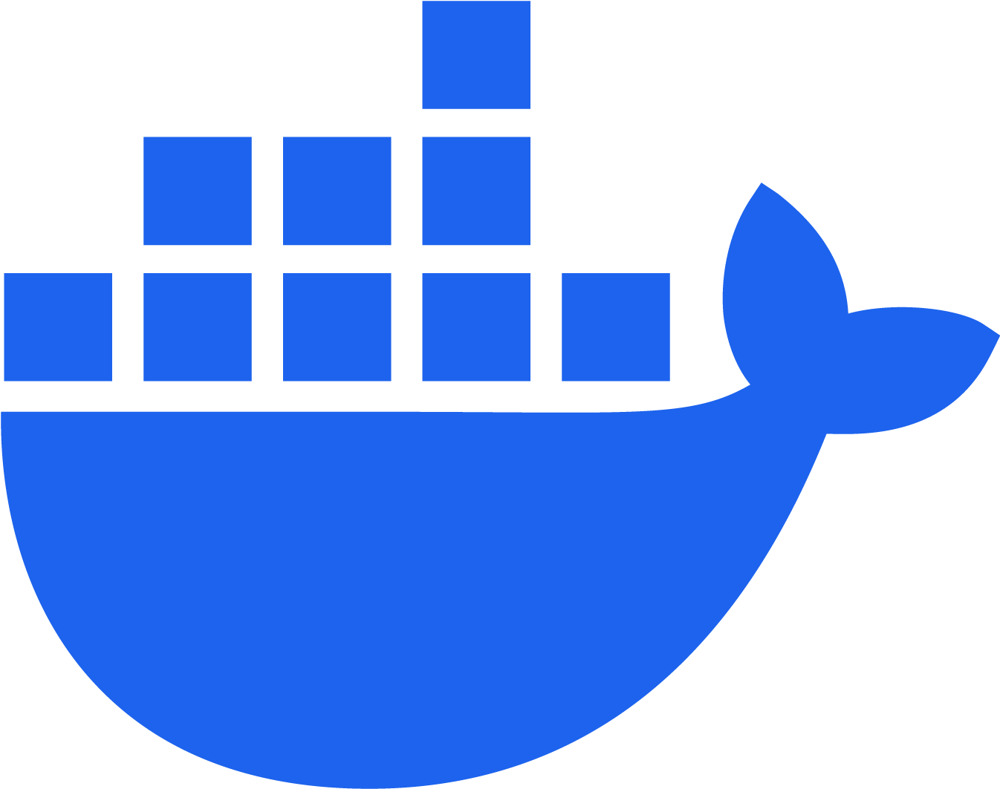
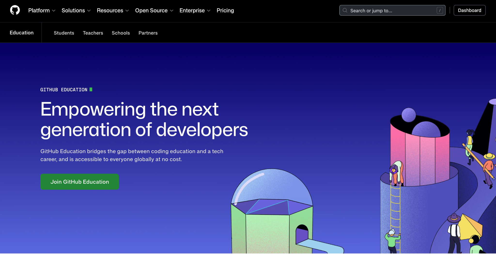
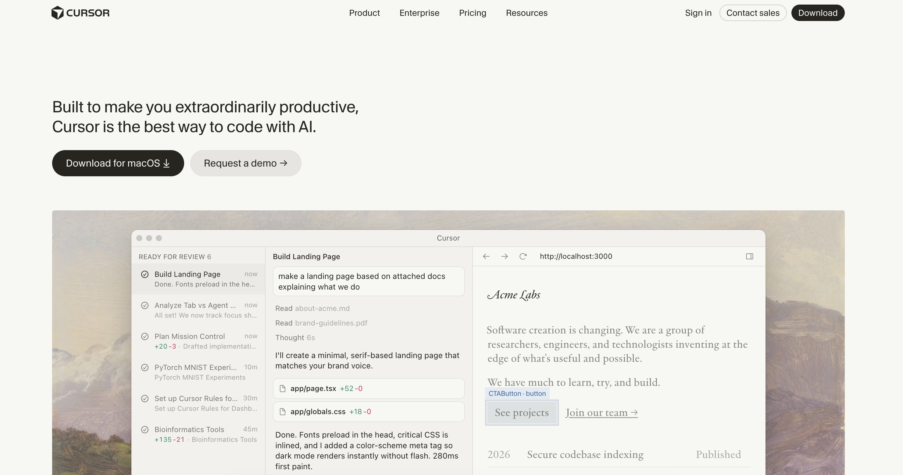
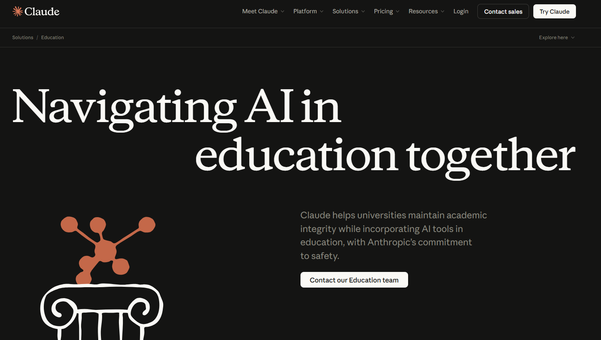
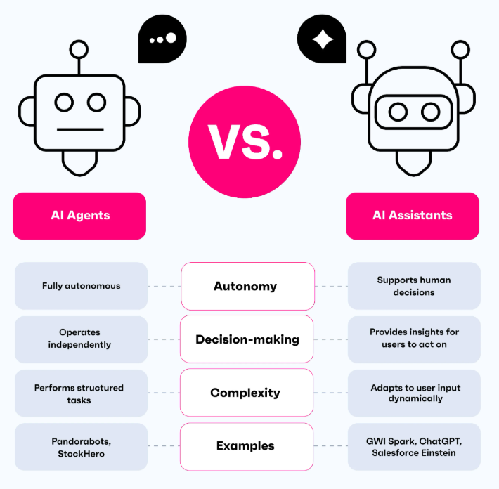
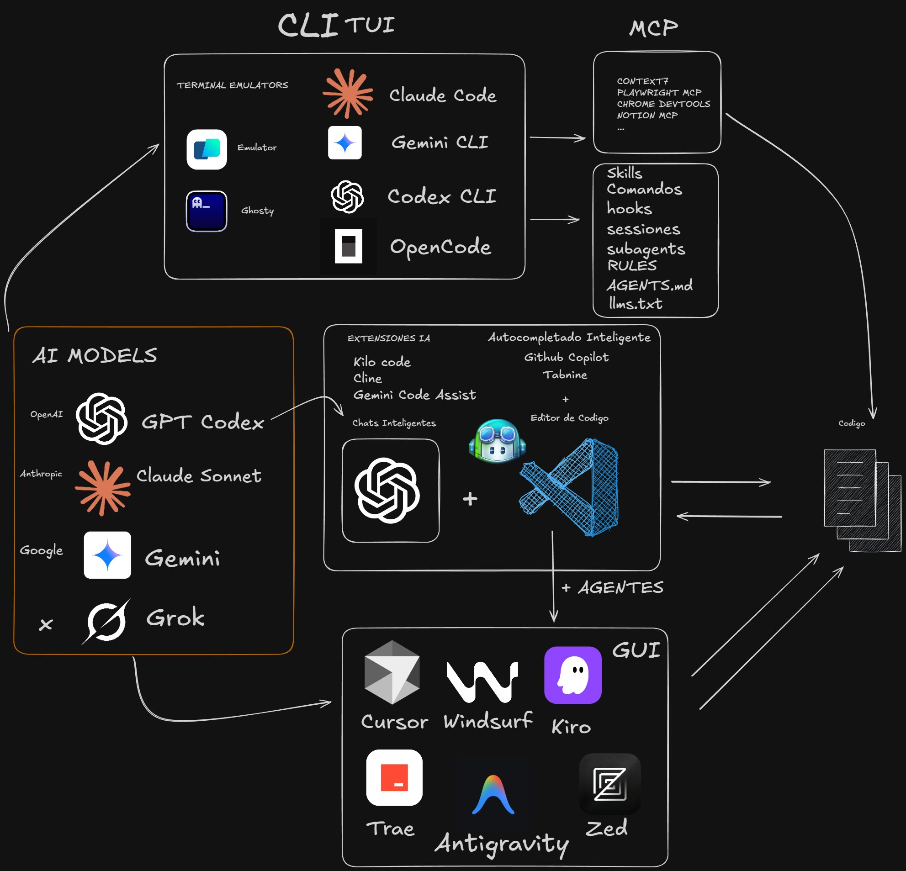
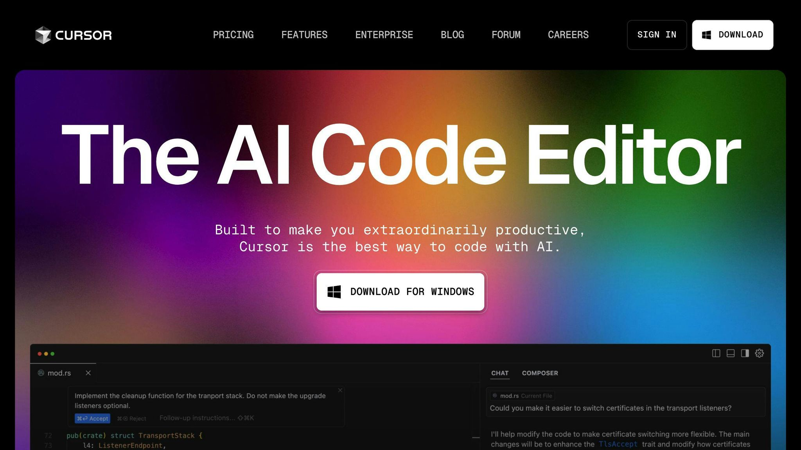

##  {#hello-quarto-title data-menu-title="Hola Quarto" background-image="images/horst_penguins_telescope.png" data-state="no-logo"}


[Ya no programas solo]{.custom-title}
[Cómo usar agentes de IA en tu proyecto]{.custom-subtitle}

[Francisco Alfaro Medina <br> Valeska Canales Pozo]{.custom-author}

[<https://dtd.com/talks>]{.custom-url}

##  Programar es fácil { background-opacity="0.25" transition="zoom"}

::: r-stack
{.fragment .fade-in-then-out fig-align="center" width="40%"}
:::


------------------------------------------------------------------------

## Pero ... todo lo demás { background-opacity="0.25" transition="zoom"}


<br>

::: columns
::: {.column width="30%" .incremental} 

-   debug
-   arquitectura\
-   documentación\
-   pruebas\
-   organizar ideas\
-   ...
-   *(y mil cosas más)*
:::

::: {.column width="70%" .fragment}
{width="60%" fig-align="center"}
:::
:::

------------------------------------------------------------------------


## Y lo estás haciendo solo { background-opacity="0.25" transition="zoom"}

<br>

{width="50%" fig-align="center"}


------------------------------------------------------------------------

##  {#unifies-extends-1 .centered data-menu-title="Unifies and extends 1" background-color="#0F1620" auto-animate="true"}

::: {style="margin-top: 150px; font-size: 2em; color: #75AADB;"}
Ya no compites **solo**
:::


##  {#unifies-extends-2 .centered data-menu-title="Unifies and extends 2" background-color="#0F1620" auto-animate="true"}

::: {style="margin-top: 100px; font-size: 2em; color: #75AADB"}
Ya no compites **solo**
:::


::: large
Compites contra developers con IA
:::

::: {.fragment }
{width="70%" fig-align="center"}
:::

------------------------------------------------------------------------

## La Mayoría de los developers usa IA { background-opacity="0.25" transition="zoom"}

::: r-stack
<br>

{.fragment .fade-in-then-out fig-align="center"}


{.fragment fig-align="center"}
:::

------------------------------------------------------------------------

## <span style="font-size: 3.5rem;">No es aprender IA ... Es trabajar distinto</span>   { background-opacity="0.25" transition="zoom"}

<br><br>

::: columns
::: {.column width="33%"}
::: {style="text-align:center;"}
<br>
**Como GitHub**\
*La IA es un colaborador más en tu flujo de trabajo*
:::
:::

::: {.column .fragment width="34%"}
::: {style="text-align:center;"}
<br>
**Como Docker**\
*Prompts como Dockerfiles: reproducibles*
:::
:::

::: {.column .fragment width="33%"}
::: {style="text-align:center;"}
<br>
**Como Stack Overflow**\
*El skill sigue siendo el mismo: saber qué preguntar*
:::
:::
:::

------------------------------------------------------------------------

## Si dos personas saben lo mismo { transition="fade"}

<br>

::: columns
::: {.column width="50%"}
::: {.fragment .fade-in-then-semi-out}
::: {style="text-align:center; font-size:4em;"}
🧑‍💻
:::
<p style="text-align:center; font-size:1.2em;">Developer A<br><span style="font-size:0.7em; color:#aaa;">sin herramientas de IA</span></p>
:::
:::

::: {.column width="50%"}
::: {.fragment}
::: {style="text-align:center; font-size:4em;"}
👩‍💻⚡
:::
<p style="text-align:center; font-size:1.2em;">Developer B<br><span style="font-size:0.7em; color:#75AADB;">resuelve en la mitad del tiempo</span></p>
:::
:::
:::

<br>

::: {.fragment}
<div style="text-align:center; font-size:2em; font-weight:bold; color:#9CE0F6;">
¿a quién eliges?
</div>
:::

------------------------------------------------------------------------

## No necesitas nada especial { background-opacity="0.25" transition="fade"}

<br>

::: {style="text-align: center;" .fragment}

:::


------------------------------------------------------------------------

##  {background-opacity="0.25" transition="fade"}

<br>

::: r-stack
{.fragment .fade-in-then-out fig-align="center"}

{.fragment .fade-in-then-out fig-align="center"}

{.fragment fig-align="center"} 
:::


------------------------------------------------------------------------


# <br> Comencemos! {.title-top-light background-image="images/horst_quarto_penguins_teach.png" data-state="no-logo"}


## ¿Qué es un Agente AI? { background-opacity="0.25" transition="fade"}

::: r-stack
{.fragment .fade-in-then-out fig-align="center" width="80%"}
:::


##  {background-opacity="0.25" transition="fade"}


::: r-stack
{.fragment .fade-in-then-out fig-align="center" width="55%"}

:::


##  {background-opacity="0.25" transition="fade"}

::: r-stack
{.fragment .fade-in-then-out fig-align="center" width="70%"}

{.fragment fig-align="center"} 


:::


## ¿Qué es Cursor? { background-opacity="0.25" transition="fade"}

<br>

::: {style="text-align: center;" .fragment}
<iframe src="images/cursor.html" width="1200px" height="800px"></iframe>
:::


## Pequeño Ejemplo { background-opacity="0.25" transition="fade"}


::: r-stack
{.fragment .fade-in-then-out fig-align="center" width="100%"}

:::


# Hora del "adiós" {.title-top-dark background-image="images/horst_quarto_penguins_thankyou.png" data-state="no-logo"}


## 🎉 ¡Gracias por Participar! { background-opacity="0.25"}

::: columns
::: {.column width="50%"}
<br>

❓ ¿Preguntas?

👏 Responder [encuesta](https://forms.gle/SHNh4LEJpfWSvZRk7)

🥳 Disfrutar del Evento!
:::

::: {.column width="50%" align="center"}
{width="400"}
:::
:::

> 🔗 Nuestro Sitio Web: [transformaciondigital.usm.cl/dtd/](https://transformaciondigital.usm.cl/dtd/)


```{=html}
<style>
/* Ajusta el tamaño del título y subtítulo */
.reveal .slides h1 {
  font-size: 2em; /* Tamaño más pequeño para el título */
}

.reveal .slides h2 {
  font-size: 1.5em; /* Tamaño más pequeño para el subtítulo */
}

/* Ajusta el tamaño del texto en los párrafos */
.reveal .slides p {
  font-size: 0.8em; /* Texto más pequeño */
}

/* Ajusta el tamaño de las tablas */
.reveal .slides table {
  font-size: 0.8em; /* Tamaño de fuente más pequeño en las tablas */
  width: 90%; /* Ajusta el ancho de la tabla */
  margin: 0 auto; /* Centra la tabla */
}

/* Ajusta el tamaño de los bullets */
.reveal .slides ul {
  font-size: 0.8em; /* Tamaño de fuente más pequeño en los bullets */

}

.reveal .slide-logo {
   max-height: 2.5em !important;

}

</style>
```