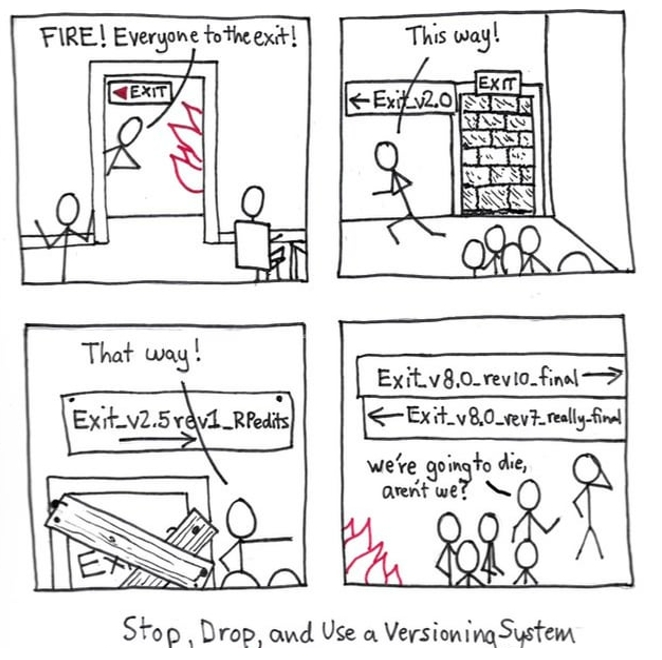
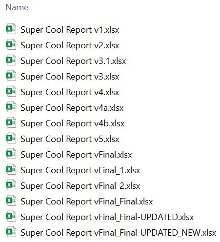
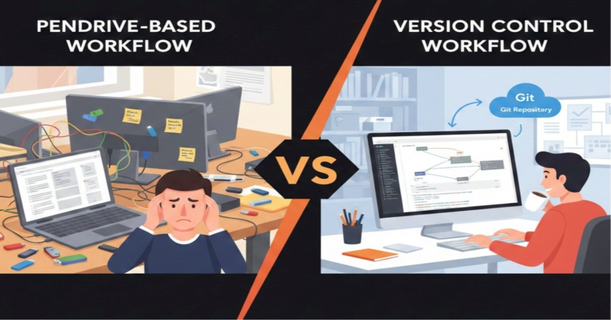
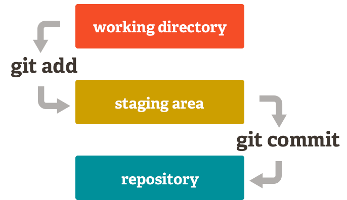
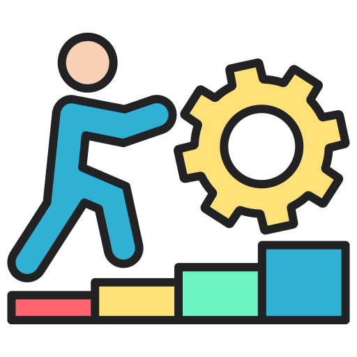
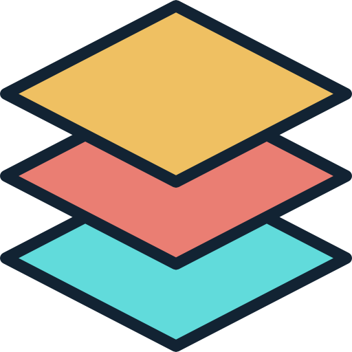
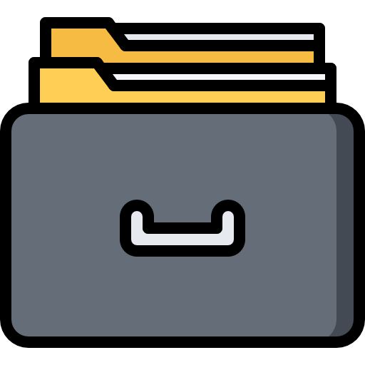
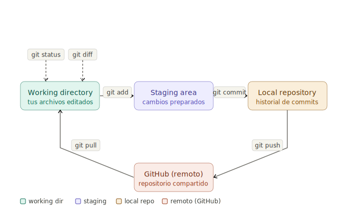

##  {#inf236 data-menu-title="Hola Quarto" background-image="images/horst_penguins_telescope.png" data-state="no-logo"}

[Control de Versiones con Git]{.custom-title} [Del caos al orden]{.custom-subtitle}

<br>

[Francisco Alfaro Medina <br> Valeska Canales Pozo <br> Mario Navarrete Purcell]{.custom-author}

------------------------------------------------------------------------

##  {background-opacity="0.25" transition="zoom"}

::::: r-stack
::: {.fragment .fade-in-then-out}
<iframe src="images/dtd.html" width="1200" height="530" frameborder="0" scrolling="si" style="max-width:100%; border:1px solid #CCC; border-radius:10px;" allowfullscreen>

</iframe>
:::

::: fragment
{.fade-in-then-out fig-align="center" width="80%"}
:::
:::::

------------------------------------------------------------------------

## Trabajar sin Git {background-opacity="0.25" transition="zoom"}

::: r-stack
{.fragment .fade-in-then-out fig-align="center" width="95%"}
:::

------------------------------------------------------------------------

## El problema real {background-opacity="0.25" transition="fade"}

<br>

::::: columns
::: {.column .incremental width="30%"}
<br>

-   `informe_final.docx`
-   `informe_final_v2.docx`
-   `informe_final_BUENO.docx`
-   `informe_final_ESTE.docx`
-   `informe_final_de_verdad.docx`
-   ...
-   *(y mil archivos más)*
:::

::: {.column .fragment width="70%"}
{width="60%" fig-align="right"}
:::
:::::

------------------------------------------------------------------------

##  {#unifies-extends-1 .centered data-menu-title="Unifies and extends 1" background-color="#0F1620" auto-animate="true"}

::: {style="margin-top: 150px; font-size: 2em; color: #75AADB;"}
El problema no es el archivo
:::

##  {#unifies-extends-2 .centered data-menu-title="Unifies and extends 2" background-color="#0F1620" auto-animate="true"}

::: {style="margin-top: 100px; font-size: 2em; color: #75AADB"}
El problema no es el archivo
:::

::: large
Es no tener **control de versiones**
:::

::: fragment
{width="70%" fig-align="center"}
:::

------------------------------------------------------------------------

## Para eso existe Git + GitHub {background-opacity="0.25" transition="zoom"}

<br> <br>

<div style="display: flex; justify-content: center; align-items: center; gap: 20px;">
  
  
</div>

------------------------------------------------------------------------

## Objetivos del Estudio {background-opacity="0.25"}

<br>

::::: columns
::: {.column width="35%"}

:::

::: {.column .incremental width="65%"}
<br><br>

-   ¿Qué es **Git** y cómo piensa?
-   **Repositorios** y su anatomía en GitHub.
-   **Branches + PR**: flujo real de trabajo.
-   **GitHub Flow**: cómo colaborar sin pisarse.
:::
:::::

# <br> Comencemos! {.title-top-light background-image="images/horst_quarto_penguins_teach.png" data-state="no-logo"}


## ¿Cómo piensa Git? {background-opacity="0.25" transition="zoom"}

<br><br>

::: r-stack
{ .fragment fig-align="center"}
:::


## Los tres estados de Git {background-opacity="0.25" transition="fade"}

<br><br>

::::::::: columns
:::: {.column width="33%"}
::: {style="text-align:center;"}
<br> **Working Directory**<br>
<span style="font-size:0.75em; color:#aaa;">Donde editas tus archivos libremente</span>
:::
::::

:::: {.column .fragment width="34%"}
::: {style="text-align:center;"}
<br> **Staging Area**<br>
<span style="font-size:0.75em; color:#aaa;">Lo que prepararás para el próximo commit</span>
:::
::::

:::: {.column .fragment width="33%"}
::: {style="text-align:center;"}
<br> **Repository**<br>
<span style="font-size:0.75em; color:#aaa;">Historial permanente de snapshots</span>
:::
::::
::::::::: 


## El ciclo básico {background-opacity="0.25" transition="fade"}

<br>

::: fragment
```bash
# Ver qué ha cambiado
git status
git diff

# Preparar cambios (staging)
git add archivo.py          
git add .                  

# Guardar snapshot (commit)
git commit -m "feat: agregar función de predicción"

# Sincronizar con GitHub
git push origin main
git pull origin main   
```
:::


## {background-opacity="0.25" transition="fade"}

{width="1000px"}


## Pequeño Ejemplo {background-opacity="0.25" transition="fade"}

::: r-stack
{.fragment .fade-in-then-out fig-align="center" width="100%"}
:::

## Conclusiones {background-opacity="0.25" transition="fade"}

<br>

<iframe src="images/conclusiones2.html" width="1200" height="380" frameborder="0" scrolling="si" style="max-width:100%; border:1px solid #CCC; border-radius:10px;" allowfullscreen>

</iframe>

# Hora del "adiós" {.title-top-dark background-image="images/horst_quarto_penguins_thankyou.png" data-state="no-logo"}

## 🎉 ¡Gracias por Participar! {background-opacity="0.25"}

::::: columns
::: {.column width="50%"}
<br>

❓ ¿Preguntas?

👏 Responder [encuesta](https://forms.gle/mwk7kRgRqpSdXHUH7)

🥳 Disfrutar del Evento!
:::

::: {.column width="50%" align="center"}
{width="400"}
:::
:::::

> 🔗 Nuestro Sitio Web: [transformaciondigital.usm.cl/dtd/](https://transformaciondigital.usm.cl/dtd/)

```{=html}
<style>
/* Ajusta el tamaño del título y subtítulo */
.reveal .slides h1 {
  font-size: 2em; /* Tamaño más pequeño para el título */
}

.reveal .slides h2 {
  font-size: 1.5em; /* Tamaño más pequeño para el subtítulo */
}

/* Ajusta el tamaño del texto en los párrafos */
.reveal .slides p {
  font-size: 0.8em; /* Texto más pequeño */
}

/* Ajusta el tamaño de las tablas */
.reveal .slides table {
  font-size: 0.8em; /* Tamaño de fuente más pequeño en las tablas */
  width: 90%; /* Ajusta el ancho de la tabla */
  margin: 0 auto; /* Centra la tabla */
}

/* Ajusta el tamaño de los bullets */
.reveal .slides ul {
  font-size: 0.8em; /* Tamaño de fuente más pequeño en los bullets */

}

.reveal .slide-logo {
   max-height: 2.5em !important;

}

</style>
```